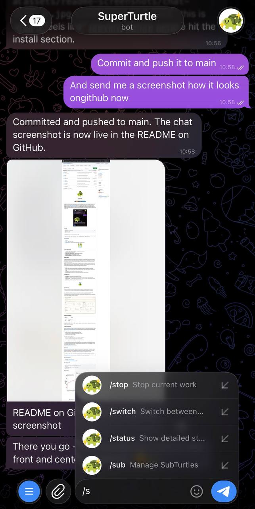
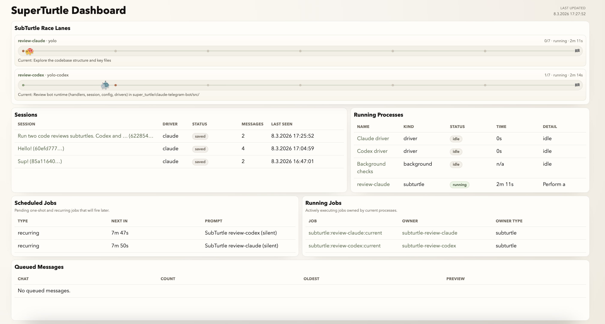

<p align="center">
  
</p>

<h3 align="center">superturtle</h3>
<p align="center">Code from anywhere with your voice.</p>

<p align="center">
  <a href="https://www.npmjs.com/package/superturtle"></a>
  <a href="LICENSE"></a>
  <a href="https://www.superturtle.dev/docs"></a>
</p>

---

SuperTurtle is an autonomous coding agent you control from Telegram. Send a voice message or text from your phone, and it runs [Claude Code](https://claude.ai/code) (or [Codex](https://openai.com/index/introducing-codex/), beta) on your machine to write code, run tests, fix bugs, and ship features. You can be on the couch, on a walk, or on a completely different machine. For bigger tasks it spins up parallel workers called SubTurtles and supervises them to completion. You get milestone updates as things land, not a wall of logs.

## Install

```bash
npm install -g superturtle
superturtle init
superturtle start
```

For normal local use, `superturtle start` is the command that makes the bot run continuously. Use `superturtle stop` to stop it.

Do not manually run both `start` and `service run`. `service run` is the internal foreground runner used by `launchd`, `systemd`, and cloud-managed runtimes.

For agents and CI, init runs non-interactively with flags:

```bash
superturtle init --token <BOT_TOKEN> --user <TELEGRAM_USER_ID> --openai-key <KEY>
```

### Prerequisites

- [Bun](https://bun.sh) ≥ 1.0
- [tmux](https://github.com/tmux/tmux) — `brew install tmux`
- [Claude Code](https://claude.ai/code) CLI — uses your existing subscription, no extra API keys

<p align="center">
  
</p>

## Why superturtle

1. **Uses your Claude Code subscription** — no extra API-token workflow.
2. **Mobile + voice first** via Telegram.
3. **Long-running, multi-step work** — spawns parallel SubTurtles.
4. **Milestone updates** — you get progress, not noise.
5. **Works from anywhere** — phone, tablet, another machine.

## What it looks like

<p align="center">
  
  &nbsp;&nbsp;
  
</p>

## SubTurtles

SubTurtles are autonomous worker agents that run in isolated loops. The Meta Agent spawns them for bounded tasks, while the conductor owns durable worker lifecycle state and recovery. Each SubTurtle gets its own working directory under `.subturtles/` with a task file, `CLAUDE.md`, and logs, while canonical orchestration state lives under `.superturtle/state/`.

Workers emit checkpoints, completion requests, and fatal-error facts. The conductor reconciles those facts into lifecycle states such as `running`, `completion_pending`, `completed`, `failed`, `timed_out`, and `archived`, then drives wakeups and inbox delivery from that persisted state instead of chat history.

Loop types:

- **yolo** — single Claude Code call per iteration. Fast, autonomous ralph loop. The default for most tasks.
- **slow** — plan, groom, execute, review. Four agent calls per iteration. More careful, better for complex or risky work.
- **yolo-codex** — same as yolo but runs Codex instead of Claude.
- **yolo-codex-spark** — same as yolo-codex but with Codex Spark for faster iterations.

## Architecture

- **Meta Agent** — the bot itself. Plans, delegates, supervises.
- **SubTurtles** — autonomous workers running in ralph loops (yolo, slow, yolo-codex, yolo-codex-spark).
- **Conductor state** — durable worker lifecycle/event state in `.superturtle/state/` with wakeup/inbox delivery.
- **MCP servers** — stickers, bot-control, ask-user (inline buttons).
- **Drivers** — Claude Code (primary), Codex (optional).

<p align="center">
  
</p>

## Dashboard

SuperTurtle includes a local-only dashboard for operational visibility. It is enabled by default when you run `superturtle start`. On startup, the bot prints the exact local dashboard URL (including the active port).

Open the dashboard using the startup URL the bot prints. For normal local use, you do not need any extra dashboard settings. If you want to disable the dashboard entirely, set `DASHBOARD_ENABLED=false`.

The dashboard shows active sessions, SubTurtle lanes, cron/current jobs, deferred queue pressure, and conductor views (`workers`, `wakeups`, `inbox`) in one place.

<p align="center">
  
</p>

## Platform support

| Platform | Status |
|----------|--------|
| macOS    | Fully supported |
| Linux    | Alpha |
| Windows  | Not yet (WSL2 may work) |

**macOS note:** Enable `System Settings → Battery → Options → Prevent automatic sleeping when the display is off` when on power adapter.

## TOS compliance

Super Turtle spawns the `claude` CLI binary as a child process (`claude -p --output-format stream-json`). This is the [officially documented headless usage](https://docs.anthropic.com/en/docs/claude-code/cli-usage) — the same way CI pipelines and editor extensions invoke Claude Code.

**What Super Turtle does:**
- Spawns `claude` as a subprocess with standard CLI flags
- Uses your existing CLI authentication (your logged-in session)
- Reads structured output from stdout

**What Super Turtle does NOT do:**
- Extract or reuse OAuth tokens from your keychain for model inference
- Proxy your subscription credentials to other users or services
- Use the Anthropic API or Agent SDK with subscription OAuth tokens
- Circumvent Claude Code's rate limiting or usage caps

The `/usage` bot command reads your local OAuth token solely to call Anthropic's own usage-reporting endpoint (`api.anthropic.com/api/oauth/usage`) — the same endpoint Claude Code's built-in `/usage` displays. It is read-only and never used for model inference.

See the [full TOS compliance page](https://www.superturtle.dev/docs/config/tos-compliance) for details.

## Security

Super Turtle runs Claude Code with `--dangerously-skip-permissions` plus an explicit `--allowedTools` allowlist for the bot's normal tool surface. Every file read, file write, and shell command happens without a confirmation prompt. This is by design — confirming each action from your phone would make the tool unusable.

You should run Super Turtle in a sandboxed or dedicated environment (VM, container, separate user account) — it has full access to read, write, and execute within configured paths. Multiple defense layers (user allowlist, rate limiting, path validation, command blocking, audit logging) reduce risk, but the permission model is inherently open. Read the [full security model](https://www.superturtle.dev/docs/config/security) for threat model, incident response, and deployment checklist.

## Documentation

- **Docs site:** [superturtle.dev/docs](https://www.superturtle.dev/docs)
- **Quickstart:** [superturtle.dev/docs/quickstart](https://www.superturtle.dev/docs/quickstart)

## Development

```bash
git clone https://github.com/Rigos0/superturtle.git
cd superturtle
npx superturtle init          # installs deps, creates .superturtle/.env, prompts for tokens
node super_turtle/bin/superturtle.js start
# stop later:
node super_turtle/bin/superturtle.js stop
```

If you have the npm package installed globally, use the explicit `node super_turtle/bin/superturtle.js ...` form while developing this repo so you run the source version, not the global install.

For `launchd`, `systemd`, and E2B supervisors, use `node super_turtle/bin/superturtle.js service run`.

## Star History

[](https://star-history.com/#Rigos0/superturtle&Date)
